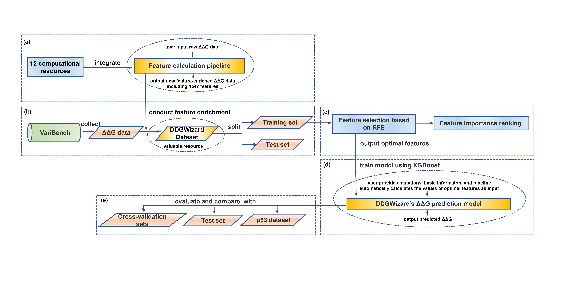

.. _introduction:

Introduction
=============

.. raw:: html

   <b>Background:</b>
   

   Thermostability is an important property of proteins and a critical factor for their wide application. Accurate prediction of ΔΔG enables the estimation of the impact of mutations on thermostability in advance. A range of ΔΔG prediction methods has now emerged, especially those based on machine learning. However, their prediction performance remains limited due to insufficiently informative training features. So far, although many computational resources have been used to calculate ΔΔG features or output potentially relevant features, little effort has been made to integrate them for the comprehensive calculation.
   

   

   <b>Characteristics:</b>
   

   we integrated 12 computational resources to develop a pipeline capable of automatically calculating 1547 features. In addition, through data collection and application of our pipeline, the feature-enriched DDGWizard dataset was created, including 15752 ΔΔG data. Furthermore, we performed feature selection and developed an accurate ΔΔG prediction model that achieved an R² of 0.61 in cross-validation and outperformed several other representative prediction methods in comparisons. Together, the feature calculation pipeline, DDGWizard dataset, and prediction model constitute the DDGWizard system, freely available for ΔΔG analysis and prediction.
   

   

.. raw:: html

   

Figure 1. The development and validation processes of DDGWizard.

.. raw:: html

   

   <b>Purpose:</b>
   

   The application program and dataset of DDGWizard have been published. This document provides detailed guidance on how to use them.
   

   

